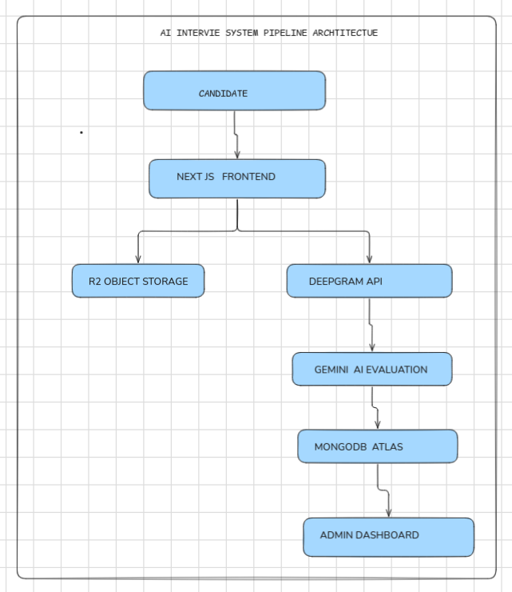

# AI Interview Evaluation Platform

An AI-powered interview assessment system that enables recruiters to create interview sessions, collect candidate video responses, automatically transcribe and evaluate answers using AI, and review recordings, transcripts, scores, and feedback from a centralized dashboard.

---

# Architecture Diagram

> Insert your Excalidraw architecture image here.

---

# Problem Understanding

## What Problem Does This Solve?

Recruiters spend a significant amount of time reviewing candidate interviews, taking notes, evaluating responses, and comparing applicants. This process becomes increasingly difficult as the number of candidates grows.

The AI Interview Evaluation Platform automates the initial screening process by combining video interviews, speech transcription, AI-powered evaluation, and centralized recruiter review tools.

## Why Is This System Needed?

* Reduce recruiter workload.
* Standardize candidate evaluation.
* Scale interview screening.
* Store interview recordings for future review.
* Generate structured AI feedback automatically.
* Allow recruiters to review candidates asynchronously.

---

# Architecture Overview

## High-Level System Architecture

Candidate Browser
↓
Next.js Frontend (Vercel)
↓
Cloudflare Tunnel
↓
Express.js Backend (Linux VPS)
↓
Cloudflare R2 + MongoDB
↓
Deepgram + Gemini AI
↓
Recruiter Dashboard

---

## Media Processing Pipeline

Candidate records video response
↓
Video uploaded to Express backend
↓
Temporary processing on VPS
↓
Stored in Cloudflare R2
↓
Audio sent to Deepgram
↓
Transcript generated
↓
Transcript sent to Gemini
↓
Evaluation generated
↓
Results stored in MongoDB
↓
Recruiter reviews results

---

## Application Flow

1. Recruiter generates a unique interview link.
2. Candidate opens the interview session.
3. Candidate grants camera and screen recording permissions.
4. Candidate records responses.
5. Responses are uploaded to the backend.
6. Videos are stored in Cloudflare R2.
7. Deepgram generates transcripts.
8. Gemini evaluates transcripts.
9. Results are stored in MongoDB.
10. Recruiters review scores, transcripts, recordings, and feedback from the Admin Dashboard.

---

# Deployment Architecture

## Frontend

Hosted on **Vercel**.

Responsibilities:

* Candidate interview experience
* Admin dashboard
* Media capture
* Session management
* UI rendering

---

## Backend

Hosted on a **Linux VPS**.

Responsibilities:

* Media uploads
* Cloudflare R2 integration
* Deepgram transcription
* Gemini evaluation
* MongoDB operations
* Session processing

---

## Public Access Layer

**Cloudflare Tunnel** securely exposes backend services running on the VPS without directly exposing server ports to the public internet.

Benefits:

* Additional security
* No public port exposure
* Easy remote access
* Simplified deployment

---

## Storage Layer

### Cloudflare R2

Stores:

* Camera recordings
* Screen recordings

### MongoDB

Stores:

* Interview sessions
* Candidate responses
* Transcripts
* Scores
* Feedback
* Processing metadata
* Error logs

---

# Technical Decisions & Tradeoffs

## Why This Architecture?

Frontend, backend, storage, and AI services are separated to keep responsibilities clear and allow independent scaling.

## Why Cloudflare R2?

* Persistent object storage
* Lower storage cost
* Reduces VPS disk usage
* Easy integration with Node.js

## Why Temporary File Processing?

Videos are temporarily stored on the VPS only during processing.

Benefits:

* Conserves disk space
* Prevents storage accumulation
* Simplifies cleanup

After processing:

* Videos remain in Cloudflare R2
* Temporary local files are deleted

## Why Deepgram + Gemini?

### Deepgram

Used for high-quality speech-to-text transcription.

### Gemini

Used to evaluate transcripts and generate:

* Score
* Communication assessment
* Technical relevance
* Strengths
* Weaknesses
* Recruiter feedback

---

# Failure Scenarios & Edge Cases

## Network Interruptions

Upload failures are detected and surfaced to users.

## Camera / Microphone Disconnects

Media permission failures are detected before participation.

## Partial Upload Failures

Uploaded files are validated before processing.

## Empty or Corrupted Media

Media files are validated before transcription begins.

## Duplicate Interview Attempts

Completed interview tokens are verified before allowing access.

## AI Service Failures

If Deepgram or Gemini fails:

* Session remains available
* Recordings remain accessible
* Errors are logged in MongoDB

---

# Recovery Mechanisms

## Error Recovery

Failures are recorded without crashing the interview session.

## Data Preservation

Even if AI evaluation fails:

* Camera recording remains available
* Screen recording remains available
* Recruiters can manually review candidates

## Session Visibility

Failed sessions remain visible inside the Admin Dashboard.

## Failure Handling

The platform logs processing failures and exposes them to administrators instead of silently failing.

---

# Product Thinking

## Recruiter Experience

The dashboard provides:

* Candidate status
* Average score
* AI feedback
* Transcript review
* Camera recording review
* Screen recording review
* Processing error visibility

Recruiters can review all candidate artifacts from a single interface.

---

## Candidate Experience

The interface is intentionally minimal and distraction-free.

Candidates focus only on:

* Questions
* Recording
* Submission

This reduces friction and improves usability.

---

## Suspicious Activity Monitoring

The system records:

* Camera feed
* Screen activity

This allows recruiters to review candidate behavior when necessary.

---

# Scalability Considerations

## Current Bottlenecks

* Gemini API rate limits
* Deepgram API rate limits
* High-volume video uploads
* Large-scale AI processing workloads

## Future Improvements

* Redis-based background job processing.
* BullMQ queue system.
* AI-generated follow-up interview questions.
* Real-time recruiter monitoring dashboard.
* WebSocket-based live proctoring.
* WebSocket-based suspicious activity alerts.
* High-concurrency interview processing.
* Advanced analytics and reporting.

---

# Observability & Debugging

## Logging Strategy

Production failures are stored inside MongoDB.

## Error Tracking

Structured error records are maintained instead of silently failing.

## Debugging Approach

Administrators can identify:

* Failed evaluations
* Missing transcripts
* Upload issues
* AI processing failures

without manually inspecting VPS logs.

---

# AI Usage Documentation

## Deepgram

Used for speech-to-text transcription of candidate recordings.

## Gemini

Used for transcript evaluation and structured feedback generation.

Outputs include:

* Scores
* Communication analysis
* Technical relevance analysis
* Strengths
* Weaknesses
* Recruiter feedback

---

## Prompt Engineering

Prompts were designed to generate structured JSON output suitable for direct database storage.

---

## Human vs AI Contributions

### Human Decisions

* System architecture
* Backend design
* Database schema
* Storage design
* Dashboard implementation
* Deployment strategy
* API integration
* Candidate workflow

### AI-Assisted Functionality

* Transcript evaluation
* Candidate scoring
* Feedback generation

---

# Demo & Walkthrough

## Live Application

https://ai-interview-system-two.vercel.app

## Walkthrough Video

https://drive.google.com/file/d/1ZDJWqMNv4qOed9lwaLriZHiZ_iLMnnnD/view?usp=sharing

---

## System Walkthrough

Recruiter creates session
↓
Candidate completes interview
↓
Videos stored in Cloudflare R2
↓
Deepgram transcribes answers
↓
Gemini evaluates responses
↓
Results stored in MongoDB
↓
Recruiter reviews results

---

## Testing Instructions

1. Navigate to `/AdminDashboard`
2. Generate a new interview session
3. Open the generated interview link
4. Complete the interview
5. Submit responses
6. Return to the dashboard
7. Review:

   * Transcript
   * Score
   * Feedback
   * Camera Recording
   * Screen Recording

---

# Known Limitations

* Evaluation depends on external AI services.
* API rate limits may delay evaluation.
* Follow-up question generation is under development.
* Browser privacy settings may affect media permissions.

---

# Tech Stack

## Frontend

* Next.js
* React

## Backend

* Node.js
* Express.js

## Database

* MongoDB

## Storage

* Cloudflare R2

## AI Services

* Deepgram
* Gemini AI

## Deployment

* Vercel (Frontend)
* Linux VPS (Backend)
* Cloudflare Tunnel
* Cloudflare R2
